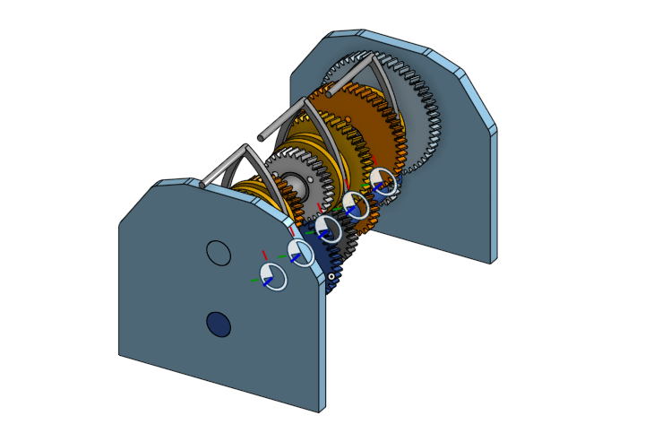
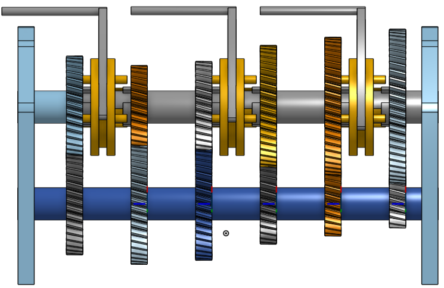
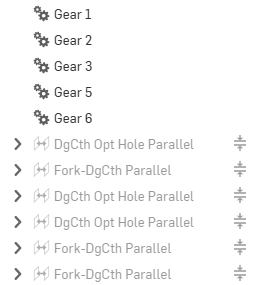
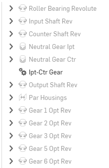

# Manual Transmission

## Project Overview

This is a learning project, not intended for real-life application. In the FIRST Robotics Competition, understanding basic gear ratios and modeling them is crucial. A manual transmission gearbox is an excellent way to apply this concept. The main goal of this project was to explore the animation potential of gear ratios between different shafts. While the model is mechanically sound and would technically function, it does not include motors, a clutch, or any driving mechanism.

## Features

To closely simulate the functionality of a real-world vehicle, this model incorporates a 6-speed manual transmission, allowing for the exploration of six distinct gear ratios.

## What I Learned

This project was a deep dive into the practical application of mechanical principles. I spent a significant amount of time learning to calculate gear ratios and determine appropriate gear sizes. A major part of the learning process was translating these concepts into a functional CAD assembly. I learned how to use various mates to ensure each part moved correctly along its shaft and in relation to other components. Specifically, I focused on using parallel, gear, and revolute mates, as these were crucial for achieving the desired motion without over-defining the assembly.

## Images

**Isometric View**

**Right View**

**Mates**

Here are some of the mates used in the assembly:

**Reference Image**

This project was modeled using the following image as a reference:
.webp)

## CAD Files

[Main Assembly.step](CAD/Main%20Assembly.step)

## References

Brain, M., Threewitt, C., & Bos, S. (2024, February 2). *How a Manual Transmission Works*. HowStuffWorks. https://auto.howstuffworks.com/transmission.htm