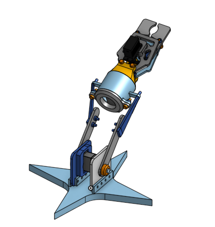

# Robotic Arm Project

This was my first CAD project using **OnShape**. The design uses an **MG550 servo** and is intended for **3D printing**.  
It helped me get comfortable with:
- Modeling
- Extruding
- Editing in context
- Importing files from **GrabCAD**
- Exploring third-party plugins in OnShape

The STL file is designed to be printable by another member of our **robotics team**.

---

## 🔧 Rendered Views

  
  

---

## 📁 CAD Files

- [Main_Assembly.stl](./CAD/Main_Assembly.stl)
